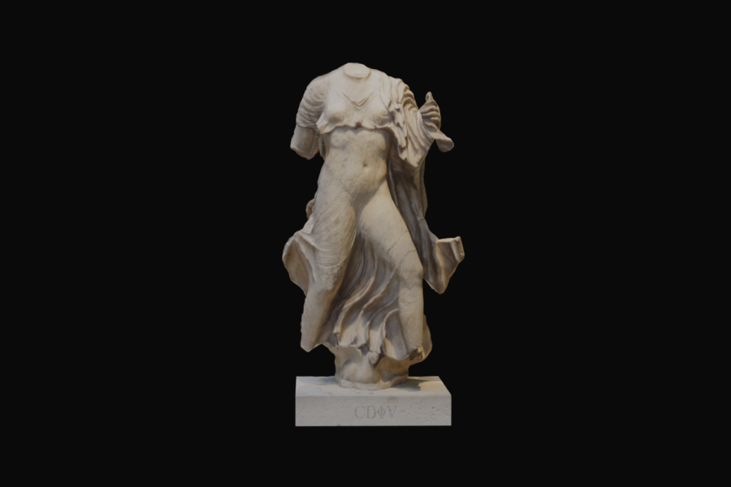

# Street Barbell
   
A five-locale (`en es fr de fi`) marketing and product site on **Next.js 14.2
App Router**, with spring-driven motion, four three.js scenes and a **Strapi**
content backend.

> **Working on this project (human or AI)? Start with the vault.**
>
> | | |
> |---|---|
> | [`obsidian/README.md`](./obsidian/README.md) | the project brain — every convention, decision and playbook |
> | [`obsidian/architecture/site-map.md`](./obsidian/architecture/site-map.md) | route → view → Strapi endpoint |
> | [`obsidian/architecture/stack-profile.md`](./obsidian/architecture/stack-profile.md) | the resolved stack: paths, bindings, commands |
> | [`.claude/stack.json`](./.claude/stack.json) | the same profile, machine-readable — **resolve paths from here** |
> | [`AGENTS.md`](./AGENTS.md) | the hard rules |
> | `.claude/scripts/verify.sh` | the mechanical gate. Baseline: `obsidian/meta/baseline-debt.md` |
>
> ```bash
> yarn && yarn dev              # requires a .env — see obsidian/architecture/environment-variables.md
> .claude/scripts/verify.sh     # check the hard rules
> ```

---

# Appendix — the starter this project was built on

> Kept for its component and hook examples. It describes the **next14-starter**,
> not Street Barbell; where the two disagree, the vault is right.

This Next.js 14 starter project provides an advanced setup with built-in Three.js, a variety of animation components, and a highly configurable layout system. It is designed to optimize animations, smooth scrolling, and user interactivity while maintaining seamless performance.

---



## Key Features

- **Three.js Integration with Tunnel**: Persist your Three.js scenes across pages for a seamless experience.
- **Lenis Smooth Scroll**: Enhances scrolling performance with buttery-smooth animations.
- **Animated Loader Layout**: Tracks page loading states and plays animations during transitions.
- **Animated Router Layout**: Provides `AnimLink` and `useAnimRouter` for managing animated page transitions.
- **Built-In Animation Components**:
  - **Spring**: General-purpose animation wrapper.
  - **Inview**: Trigger animations when an element enters the viewport.
  - **SpringTrigger**: Enables scroll-based animations.
  - **Hover**: Animates elements on hover.
- **FrameByFrame Component**: Optimized, lazy-loaded frame-by-frame animations for scroll or drag interactions.
- **TextEngine**: Easily create smooth and complex text animations.
- **SkeletonImage & SkeletonVideo**: Placeholder components for images and videos with skeleton loaders.
- **Styled Components System**: Fully responsive, styled-components-based grid system.

---

## Utilities

- `debounce`: Utility to control the rate of function execution.
- `generateMetadata`: Helper to dynamically generate metadata.
- `lerp`: Linear interpolation for smooth transitions.
- `scrollTo`: Enhanced scroll function compatible with Lenis smooth scrolling.

---

## Hooks

The project includes a set of useful hooks to improve productivity:

- `useDynamicInView`
- `useInViewRef`
- `useLoop`
- `useLoopInView`
- `useResizeLoop`
- `useSpringTrigger`
- `useWindowSize`

---

## Examples

### Animation with `Hover` Component
```tsx
import { Hover } from "@/components/Springs/Hover";

const HoverExample = () => {
  return (
    <Hover
      tag="div"
      from={{ scale: 1 }}
      to={{ scale: 1.2 }}
      style={{ backgroundColor: "lightblue", padding: "20px" }}
    >
      Hover over me!
    </Hover>
  );
};
```

### Animation with `Spring` Component
use like `useSpring` to animate any element, provide reactive state to enable props to be animated
```tsx
import { Spring } from "@/components/Springs/Spring";

const SpringExample = () => {
  return (
    <Spring
      tag="div"
      from={{ scale: 1 }}
      to={{ scale: 1.2 }}
      enabled={true}
    >
      <div>I scale in if enabled is true!</div>
    </Spring>
  );
};
```

### Animation with `Inview` Component
```tsx
import { Inview } from "@/components/Springs/Inview";

const InviewExample = () => {
  return (
    <Inview
      tag="div"
      from={{ scale: 1 }}
      to={{ scale: 1.2 }}
      style={{ backgroundColor: "lightblue", padding: "20px" }}
    >
      I fade in if visible!
    </Inview>
  );
};
```


### Scroll-Based Animation with `SpringTrigger`
```tsx
import { SpringTrigger } from "@/components/Springs/Springtrigger";

const ScrollExample = () => {
  return (
    <SpringTrigger
      tag="div"
      from={{ opacity: 0 }}
      to={{ opacity: 1 }}
      start="top top"
      end="bottom bottom"
    >
      I fade in on scroll!
    </SpringTrigger>
  );
};
```

### Text Animation with `TextEngine`
```tsx
export const TLine: NextPage<Props & EngineProps> = memo(({
    children,
    enabled = true,
    ...props
}) => {
    const { fullyLoaded } = useAssetsLoader()
    const isRerouting = useIsRerouting()
    return (
        <TextEngine
            enabled={fullyLoaded && !isRerouting && enabled}
            lineIn={{y: 0, opacity: 1}}
            lineOut={{y: 100, opacity: 0}}
            lineStagger={80}
            lineConfig={{ duration: 1200, easing: easings.easeOutCubic }}
            overflow
            showSeoText={false}
            seo={true}
            columnGap={0.6}
            {...props}
        >
            { children }
        </TextEngine>
    )
})
```

---

## How to Use

1. Clone the repository and install dependencies:
   ```bash
   git clone [repo_url]
   cd [repo_name]
   yarn
   ```

2. Start the development server:
   ```bash
   yarn dev
   ```

3. Customize your project with the built-in components and utilities.

---

## Directory Structure

- **components/**: Contains animation and utility components like `Spring`, `Hover`, `Inview`, `TextEngine`, etc.
- **hooks/**: Reusable custom hooks for animations and interactions.
- **layouts/**: Layouts for animated transitions, loaders, and asset management.
- **styles/**: Global and styled-components-based styling.
- **utils/**: Utility functions like `debounce`, `lerp`, and `scrollTo`.

---

## License

This project is licensed under the MIT License. Feel free to use and modify it
